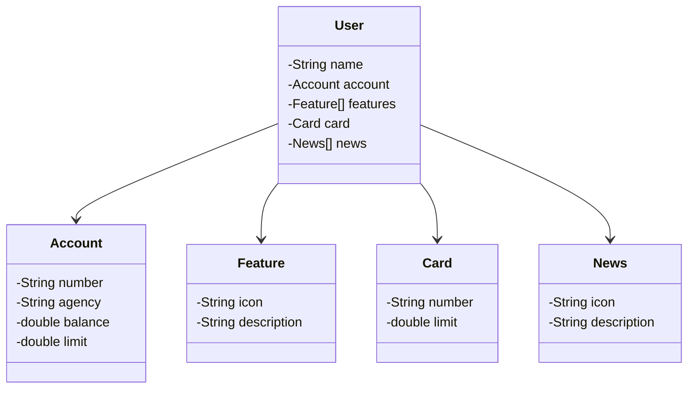

# Projeto Java/SpringBoot API RESTful

## Diagrama de Classes

```mermaid
classDiagram
    class User {
        -String name
        -Account account
        -Feature[] features
        -Card card
        -News[] news
    }

    class Account {
        -String number
        -String agency
        -double balance
        -double limit
    }

    class Feature {
        -String icon
        -String description
    }

    class Card {
        -String number
        -double limit
    }

    class News {
        -String icon
        -String description
    }

    User --> Account
    User --> Feature
    User --> Card
    User --> News
```
